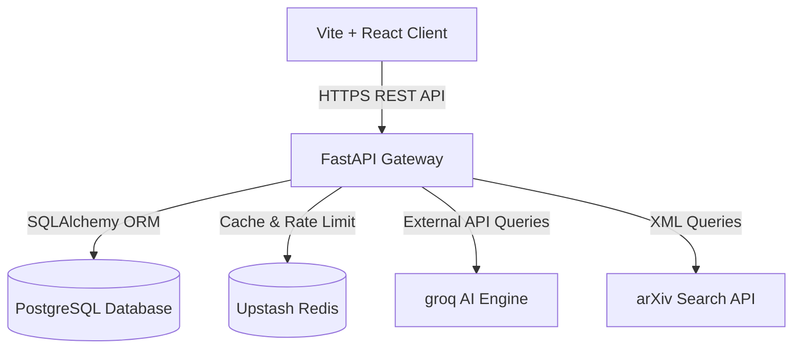
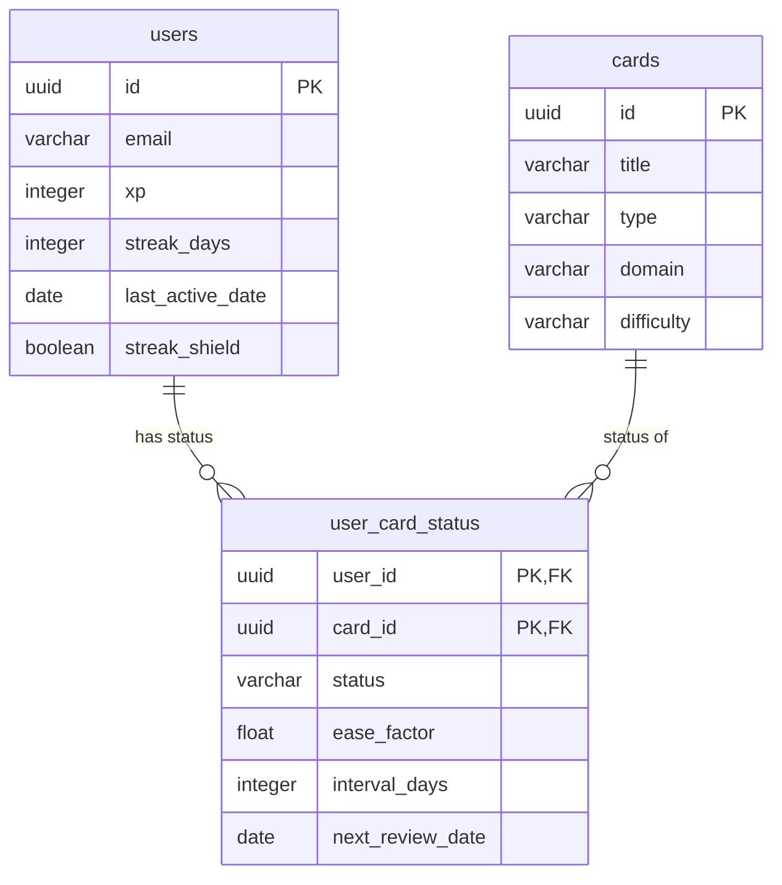

# Architecture Map — NeuroFeed Cognitive Learning OS

## System Overview

NeuroFeed is an AI-powered cognitive micro-learning platform designed on a modern decoupled architecture. The frontend React application communicates with the FastAPI Python backend through a structured, rate-limited RESTful API. Data persistence, authentication, and vector transactions are managed using a hybrid PostgreSQL database and Upstash Redis.

---

## 1. Backend Layer (`/backend`)
The backend is a high-performance Python microservices layer using **FastAPI** with async worker processes:

* **Entrypoint (`main.py`)**: Loads environment configurations, activates scheduling loops, mounts routing gateways, and injects secure production headers (HSTS, CSP, X-Frame-Options).
* **API Endpoints (`/api/routes`)**:
  - `feed.py`: Dynamic recommendation and spaced-repetition logic.
  - `cards.py`: Content interaction and custom summarization actions.
  - `quiz.py`: Topic assessment logs and verification checking.
  - `daily_challenge.py`: Daily checklist card queues and reward mechanisms.
  - `labs.py`: Copilot analogical explainers and research document summarizers.
* **Database & Models (`/db`)**:
  - Managed via **SQLAlchemy ORM** mapping Postgres tables.
  - Eager loading queries deployed to block N+1 latency bottlenecks.

---

## 2. Frontend Layer (`/frontend`)
The frontend client is an SPA constructed with **Vite**, **React**, and **TypeScript**:

* **State & Core Configurations**:
  - State Management: **Zustand** stores decoupled from rendering lifecycles (`useAuthStore`, `useSettingsStore`).
  - Network Synchronization: **TanStack React Query** manages endpoint caching, optimistic updates, and background syncing.
* **Navigation Architecture**:
  - Desktop: Fixed lateral glassmorphic sidebar.
  - Mobile: Interactive sliding navigation drawer and quick-action bottom control bar.
* **Design & Animations**:
  - Interactive styling built using curated Tailwind CSS design tokens.
  - Gestures and transition mechanics coordinated with **Framer Motion**.

---

## 3. Database Schema Map

