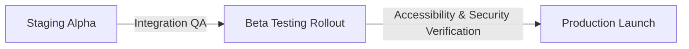

# Release Plan — NeuroFeed Transformation

This release plan outlines the execution strategy, deployment steps, and risk mitigation procedures for launching the updated NeuroFeed Cognitive Learning OS.

---

## 1. Release Milestones

### Phase 1: Local Integration & Automated QA
* **Action**: Complete backend bug patches and frontend component refactoring.
* **Testing**:
  - Run all integration tests locally.
  - Run E2E vitest suite for the Vite React frontend.

### Phase 2: Staging Alpha Deployment
* **Action**: Push code changes to staging server environment. Verify database schema migrations.
* **Verification**:
  - Audit database pool locks using simulated concurrent requests to test for race conditions on `/api/daily-challenge/complete`.
  - Validate that arXiv API querying yields zero hallucinations.
  - Manual execution of keyboard hotkeys and mobile swipe gesture virtulization.

### Phase 3: Public Beta Rollout (20% Users)
* **Action**: Roll out to a subset of users to test retention analytics, notifications, and streak purchases.
* **Metrics**:
  - Dwell time, daily challenge completion rate, streak retention rate, and server API latency logs.

### Phase 4: Production Release
* **Action**: Launch full version to all users. Monitor server loads and Redis transaction rates.

---

## 2. Risk Mitigation & Rollback Protocol

| Potential Risk | Severity | Mitigation Plan |
| :--- | :---: | :--- |
| Database Lock Contention on concurrent user requests | Medium | Eager-load indices and strictly restrict `with_for_update` scope to specific user-owned rows. |
| arXiv API Outage or Rate Limits | High | Utilize robust local SQLite/JSON caching of successfully parsed paper IDs. Fall back gracefully to abstract summaries rather than crashing. |
| 60fps Swipe Feed Rendering Drops | Medium | Maintain highly optimized card node virtualization, cleaning up detached elements from the React DOM tree. |

### Rollback Strategy
Should any major blocking issue appear post-launch, developers can execute a clean roll-back to the latest stable state:
1. Revert repository state to the prior release tag: `git checkout v1.0.0-stable`.
2. Deploy the stable version to the servers.
3. If necessary, execute downward database schema migrations to restore the state.
