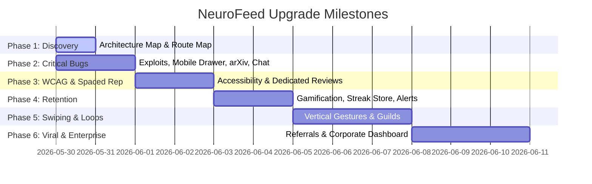

# Roadmap — NeuroFeed Transformation

This document details the prioritised milestones and release strategy to build, test, and ship a world-class cognitive learning ecosystem.

---

## 1. Milestones

### Milestone 1: Critical Bug Patches & Systems Patching (Phase 2 & 3)
* **Goal**: Eradicate reward exploits, stabilize navigation drawers, fetch verified arXiv papers, and ensure full WCAG AA keyboard accessibility.
* **Acceptance Criteria**:
  - Daily challenge reward calls require completed status for all cards, validated server-side under database lock.
  - Hamburger / sliding mobile drawer exposes all routing channels.
  - Summarizer uses verified arXiv XML metadata, rejecting hallucinations.
  - Auto-scroll anchors AI labs chats.
  - Spaced rep reviews support `1`, `2`, `3`, `4` keyboard rating hotkeys.

### Milestone 2: SM-2 Review Deck & Learning Analytics (Phase 4)
* **Goal**: Establish a dedicated spaced-repetition workflow with predictive analytics.
* **Acceptance Criteria**:
  - Independent review deck loops due concepts only.
  - Analytics dashboard displays active forgetting curves, recall rates, and concept master levels.

### Milestone 3: Retention, Gamification & Variable XP (Phase 5)
* **Goal**: Elevate platform return rate and daily active engagement.
* **Acceptance Criteria**:
  - Variable XP reward multiplier securely awarded.
  - Profile page hosts interactive Streak Freeze Store purchasing tools.
  - Auto-scheduler schedules 9 PM alerts and nightly teasers.
  - Confetti bursts and XP badges reward performance.

### Milestone 4: Swipe Feed Redesign & Recommendation scoring (Phase 6)
* **Goal**: Introduce a fluid, vertical-swipe learning card experience.
* **Acceptance Criteria**:
  - Infinite swipe deck virtualizes rendered nodes for 60fps responsiveness.
  - Feed ranked dynamically using custom domain similarity scoring.

### Milestone 5: Social Loops & Virality (Phase 7 & 8)
* **Goal**: Connect peers through guilds and drive growth via referrals.
* **Acceptance Criteria**:
  - Database supports guild joins and leaderboards.
  - Referral program tracks unique referral handles and rewards conversions.

### Milestone 6: Enterprise & Launch (Phase 9 to 12)
* **Goal**: Monetize through organizational consoles and deploy to production.
* **Acceptance Criteria**:
  - Corporate/Instructor portal renders learning assignments and student status trackers.
  - Complete security checks, load verification, and launch deployment.
